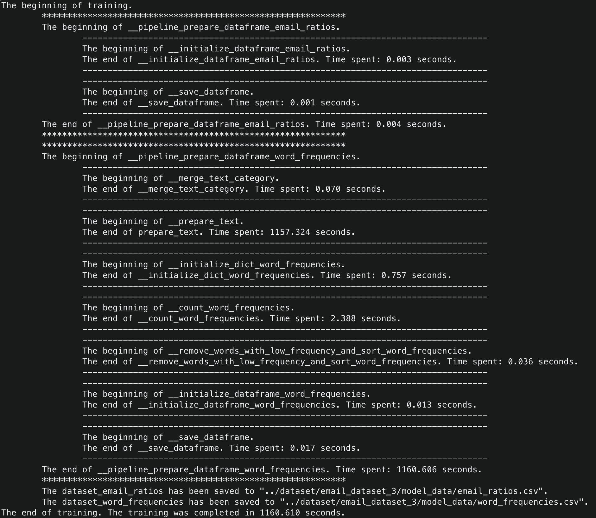
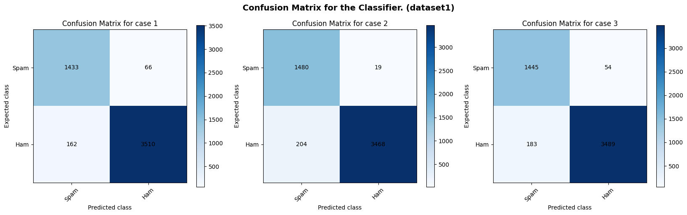
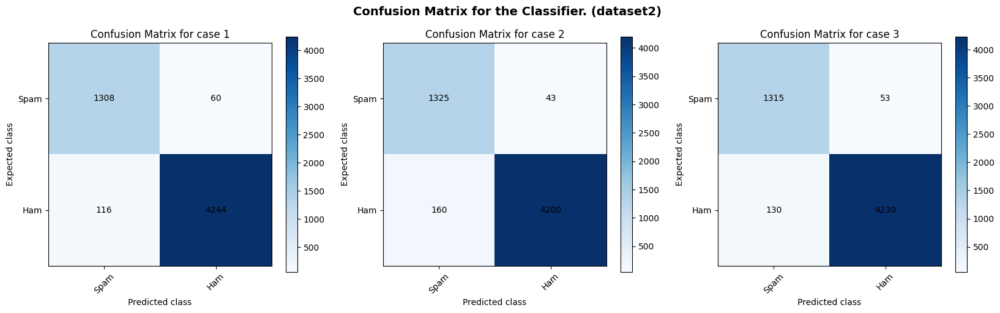

# Spam-detection-using-MultinomialNB
 
<a name="readme-top"></a>

<!-- Table of Contents -->
<details>
  <summary>Table of Contents</summary>
  <ol>
    <li>
      <a href="#about-the-project">About The Project</a>
      <ul>
        <li><a href="#built-with">Built With</a></li>
      </ul>
    </li>
    <li>
      <a href="#getting-started">Getting Started</a>
      <ul>
        <li><a href="#installation">Installation</a></li>
        <li><a href="#libraries">Libraries</a></li>
      </ul>
    </li>
    <li>
      <a href="#information_about_datasets">Information about datasets</a>
      <ul>
        <li><a href="#dataset">Dataset</a></li>
        <li><a href="#custom_dataset_format">Сustom Dataset Format</a></li>
        <li><a href="#datasets_format_for_initializing_Multinomial_Naive_Bayes_Classifier">Datasets format for initializing Multinomial Naive Bayes Classifier</a></li>
      </ul>
    </li>
    <li>
      <a href="#usage">Usage</a>
      <ul>
        <li><a href="#Class_TextProcessor">Class TextProcessor</a></li>
        <li><a href="#Class_TrainMultinomialNB">Class TrainMultinomialNB</a></li>
        <li><a href="#Class_SpamDetector">Class SpamDetector</a></li>
      </ul>
    </li>
    <li><a href="#training">Training</a></li>
    <li>
      <a href="#testing">Testing</a>
      <ul>
        <li><a href="#some_information_about_testing">Some information about testing</a></li>
        <li><a href="#dataset_1_testing_results">Dataset 1 Testing Results: Spam Mails Dataset</a></li>
        <li><a href="#dataset_2_testing_results">Dataset 2 Testing Results: Spam email Dataset</a></li>
      </ul>
    </li>
    <li><a href="#license">License</a></li>
  </ol>
</details>


<!-- About The Project -->
## <a name="about-the-project"> About The Project </a>

NLP - Natural Language Processing. This field in machine learning is dedicated to the recognition, generation, and processing of spoken and written human language. It intersects the disciplines of artificial intelligence and linguistics. NLP addresses various natural language processing tasks, such as speech recognition, text processing, information extraction, information analysis, text and speech generation, automatic summarization, and machine translation. In this project, a solution for text analysis has been implemented to determine the category (spam or ham) of a given text (message).

As of today, the issue of spam remains relevant. For instance, statistical data from 2019 provided by securelist.ru ([link_to_the_article][link_to_the_article_securelist]) indicate that globally, more than 50% of email traffic is comprised of spam. The share of spam in global email traffic for the year 2019 is shown in the figure below.


The project implements a **Multinomial Naive Bayes Classifier**. It is relatively simple to implement and demonstrates high accuracy, making it an effective solution for this problem. The implementation of the classifier addresses and resolves the following issues: "arithmetic overflow" and "unknown words". Laplace smoothing is used to address the latter issue, but you can set your own smoothing factor within the range `0 < __smoothing_factor <= 1`. Laplace smoothing corresponds to `__smoothing_factor = 1`. Classifier testing results confirm its high accuracy and suggest potential for further improvement.

The project code is located in three files: <a href="./code/SpamDetector.py">SpamDetector.py</a>, <a href="./code/TextProcessor.py">TextProcessor.py</a>, and <a href="./code/TrainMultinomialNB.py">TrainMultinomialNB.py</a>. In addition to these core files, the project includes the <a href="./code/dataset_preparation_and_analysis.ipynb">dataset_preparation_and_analysis.ipynb</a> file, which contains analysis with graphs of <a href="./dataset/email_dataset_1/spam_ham_dataset.csv">dataset 1</a>. The testing results of the implemented classifier can be found in the <a href="./code/spam_classifier_testing.ipynb">spam_classifier_testing.ipynb</a> file.

A detailed report on the theoretical and practical aspects of the work can be found in <a href="./%20Coursework%20Report.pdf">Coursework Report.pdf</a> (in Russian). Additionally, information about the practical implementation can be obtained from the code, which is sufficiently well-documented (I hope). The code documentation is provided in English. Information about the datasets used for training and testing can be found in the <a href="#dataset">Dataset</a> section. The structure of a dataset ready for training is presented in the <a href="#custom_dataset_format">Сustom Dataset Format</a> section. The structure of datasets obtained after training, which is used for initializing the classifier, is located in the <a href="#datasets_format_for_initializing_Multinomial_Naive_Bayes_Classifier">Datasets format for initializing Multinomial Naive Bayes Classifier</a> section. Information on how to work with this project is available in the <a href="#usage">Usage</a> section, while the testing results can be found in the <a href="#testing">Testing</a> section or in the corresponding <a href="./code/spam_classifier_testing.ipynb">file</a>.

### <a name="built-with"> Built With </a>

[![Badge Python][Badge_Python]][Python_home]
[![Badge NLTK][Badge_NLTK]][NLTK_home]
[![Badge Pandas][Badge_Pandas]][Pandas_home]
[![Badge NumPy][Badge_NumPy]][NumPy_home]
[![Badge Multiprocessing][Badge_Multiprocessing]][Multiprocessing_home]
[![Badge Jupyter-Notebook][Badge_Jupyter-Notebook]][Jupyter-Notebook_home]
[![Badge Matplotlib][Badge_Matplotlib]][Matplotlib_home]
[![Badge WordCloud][Badge_WordCloud]][WordCloud_home]

<p align="right">(<a href="#readme-top">back to top</a>)</p>


<!-- Getting Started -->
## <a name="getting-started"> Getting Started </a>

### <a name="installation"> Installation </a>

1. Clone the repository.
```sh
git clone https://github.com/rezabungel/Spam-detection-using-MultinomialNB.git
```
2. Be in the project's root directory.
3. Create a virtual environment.
```sh
python3.10 -m venv venv
```
4. Activate the created virtual environment.

For Linux/Mac
```sh
source venv/bin/activate
```
For Windows 
```sh
venv\Scripts\activate
```
5. Install the required libraries and dependencies.
```sh
python3.10 -m pip install -r requirements.txt
```

### <a name="libraries"> Libraries </a>

Required libraries
|   Library name   |        How to download manually          |                            Documentation                            |
| ---------------- | ---------------------------------------- | ------------------------------------------------------------------- |
| NLTK             | `python3.10 -m pip install nltk`         | [NLTK documentation][documentation-nltk]                            |
| NumPy            | `python3.10 -m pip install numpy`        | [NumPy documentation][documentation-numpy]                          |
| Pandas           | `python3.10 -m pip install pandas`       | [Pandas documentation][documentation-pandas]                        |
| Matplotlib       | `python3.10 -m pip install matplotlib`   | [Matplotlib documentation][documentation-matplotlib]                |
| Jupyter Notebook | `python3.10 -m pip install notebook`     | [Jupyter Notebook documentation][documentation-jupyter]             |
| WordCloud        | `python3.10 -m pip install wordcloud`    | [WordCloud documentation][documentation-wordcloud]                  |
| Multiprocessing  | installed by default                     | [Multiprocessing documentation][documentation-multiprocessing]      |
| String           | installed by default                     | [String documentation][documentation-string]                        |
| Math             | installed by default                     | [Math documentation][documentation-math]                            |
| os               | installed by default                     | [os documentation][documentation-os]                                |

But it would be best to use a virtual environment as demonstrated in the [Installation](#installation) section, rather than installing all the libraries manually.

<p align="right">(<a href="#readme-top">back to top</a>)</p>


<!-- Information about datasets -->
## <a name="information_about_datasets">Information about datasets</a>

### <a name="dataset"> Dataset </a>

The project utilizes three datasets of emails obtained from the [Kaggle][link_to_Kaggle]. Training was conducted for each dataset, so you can make use of the pre-trained models. It is worth noting that all datasets have different structures; therefore, before training, the datasets are standardized to the common format described in the <a href="#custom_dataset_format">Сustom Dataset Format</a> section.

Dataset 1 - **Spam Mails Dataset**: [Kaggle dataset link][link_to_dataset1_kaggle] or [link in the repository][link_to_dataset1].<br>
The training result utilized for model initialization:<br>
&nbsp;&nbsp;&nbsp;&nbsp; -> The model's email ratios data is [here][email_ratios_dataset1].<br>
&nbsp;&nbsp;&nbsp;&nbsp; -> The model's word frequencies data is [here][word_frequency_dataset1].

Dataset 2 - **Spam email Dataset**: [Kaggle dataset link][link_to_dataset2_kaggle] or [link in the repository][link_to_dataset2].<br>
The training result utilized for model initialization:<br>
&nbsp;&nbsp;&nbsp;&nbsp; -> The model's email ratios data is [here][email_ratios_dataset2].<br>
&nbsp;&nbsp;&nbsp;&nbsp; -> The model's word frequencies data is [here][word_frequency_dataset2].

Dataset 3 - **Spam Email Classification Dataset**: [Kaggle dataset link][link_to_dataset3_kaggle]. (The dataset is not in the repository because it is too large.)<br>
The training result utilized for model initialization:<br>
&nbsp;&nbsp;&nbsp;&nbsp; -> The model's email ratios data is [here][email_ratios_dataset3].<br>
&nbsp;&nbsp;&nbsp;&nbsp; -> The model's word frequencies data is [here][word_frequency_dataset3].

### <a name="custom_dataset_format"> Сustom Dataset Format </a>

To train the model, the dataset needs to be formatted to the following structure with ',' as the separator, where 0 represents "ham", and 1 represents "spam":
|     |             text            | label |
| --- | --------------------------- | ----- |
|  0  | Some text of some letter... |   1   |
|  1  | Some text of some letter... |   1   |
|  2  | Some text of some letter... |   0   |
|  3  | Some text of some letter... |   1   |
| ... |             ...             |  ...  |

Examples of prepared and ready-to-train datasets 1 and 2 can be viewed [here][link_to_dataset1_ready_to_train] and [here][link_to_dataset2_ready_to_train].

### <a name="datasets_format_for_initializing_Multinomial_Naive_Bayes_Classifier"> Datasets format for initializing Multinomial Naive Bayes Classifier </a>

To initialize the Multinomial Naive Bayes Classifier, two datasets, namely email ratios and word frequencies, are utilized, which are obtained as a result of model training.<br>

**Email Ratios Dataset:**<br>
The structure of the email ratios dataset (using "," as a separator, the dataset consists of only one row):
|                            |             ham              |             spam              |
| -------------------------- | ---------------------------- | ----------------------------- |
| **ratios-to-total-emails** | Ratio of ham to total emails | Ratio of spam to total emails |

**Word Frequencies Dataset:**<br>
The structure of the word frequencies dataset (using "," as a separator):
|        |          frequency          |            frequency_ham             |            frequency_spam             |
| ------ | --------------------------- | ------------------------------------ | ------------------------------------- |
| word_1 | Total occurrences of word_1 | Occurrences in Ham emails for word_1 | Occurrences in Spam emails for word_1 |
| word_2 | Total occurrences of word_2 | Occurrences in Ham emails for word_2 | Occurrences in Spam emails for word_2 |
| word_3 | Total occurrences of word_3 | Occurrences in Ham emails for word_3 | Occurrences in Spam emails for word_3 |
| word_4 | Total occurrences of word_4 | Occurrences in Ham emails for word_4 | Occurrences in Spam emails for word_4 |
|  ...   |             ...             |                 ...                  |                  ...                  |

<p align="right">(<a href="#readme-top">back to top</a>)</p>


<!-- Usage -->
## <a name="usage"> Usage </a>

The project implements three classes: SpamDetector, TrainMultinomialNB, and TextProcessor. They are located in modules under their respective names.

### <a name="Class_TextProcessor"> Class TextProcessor </a> - [here][link_TextProcessor.py].

The TextProcessor class is used for text processing and tokenization. This class has only one public method, called `pipeline`, representing a text processing pipeline. This pipeline includes the following steps: first, all non-ASCII characters are removed from the passed text, then the text is converted to lowercase and short words are removed, then stop-words are removed, stemming is applied, and finally tokenization occurs.<br>
When initializing an object of the TextProcessor class, you can influence the pipeline. You can set the minimum word length to be considered short (by default, this is 2; you can set any value greater than or equal to 0). Also, user-defined words can be added to the default stop word list (the default list includes stop words from the NLTK and WordCloud libraries), expanding the set of stop words that will be removed from the text.<br>
The TextProcessor class is highly versatile; it can be used wherever the implemented pipeline is needed. Specifically for this task, it is used in two other classes: TrainMultinomialNB and SpamDetector.

<details>
  <summary><div>

```python
def __init__(self, min_length: int = None, user_stop_words: list[str] | tuple[str] | set[str] = None) -> None:
```
  </div></summary>

```python
    """
    Initializes the TextProcessor object.

    Parameters:
        min_length (int, optional): Minimum word length.
            Default is 2. Should be greater than or equal to 0.
        user_stop_words (list[str] | tuple[str] | set[str], optional): The user-defined list of stop words. This list is added to the stop words defined by default.
            Default includes stop words from the nltk and wordcloud libraries.
            Example:
                user_stop_words = ['ect', 'enron', 'hou', 'hpl', 'subject']

    Raises:
        ValueError: If the provided min_length is less than 0.
        ValueError: If the provided user_stop_words is not a list, tuple, or set.
        ValueError: If the provided user_stop_words contains anything other than strings.

    Returns:
        None
    """
```
</details>

<details>
  <summary><div>

```python
def pipeline(self, raw_text: str) -> list[str]:
```
  </div></summary>

```python
    """
    Processes the text through predefined processing stages.

    Parameters:
        raw_text (str): The raw input text.

    Returns:
        list[str]: The list of processed words.
    """
```
</details>

### <a name="Class_TrainMultinomialNB"> Class TrainMultinomialNB </a> - [here][link_TrainMultinomialNB.py].

The TrainMultinomialNB class is used for training the classifier. Training is performed based on a prepared dataset of emails, the structure of which is presented in the <a href="#custom_dataset_format">Сustom Dataset Format</a> section. The result of the training is two CSV files, the structure of which can be viewed in the <a href="#datasets_format_for_initializing_Multinomial_Naive_Bayes_Classifier">Datasets format for initializing Multinomial Naive Bayes Classifier</a> section.<br>
When initializing an object of the TrainMultinomialNB class, it is necessary to specify the path to the prepared dataset of email messages.<br>
You can influence the training process through the class methods. Before starting training, you can set the minimum word frequency, which will be significant for the classifier, using the `set_min_word_frequency` method. By default, this value is 15. This means that if a specific word occurs less than 15 times during training, it will not be added to the CSV file with word frequencies. Also, before starting training, you can influence the initialization of the TextProcessor class object by passing desired handler parameters using the `set_processor` method.<br>
Model training starts by calling the `train` method, which takes the path to the folder where the two resulting CSV files will be saved. This parameter is optional, and if not passed, the result will be saved next to the email dataset file.<br>
It is worth noting the private method `__prepare_text`, which is implemented using parallelization technology. Parallelization is performed across all processor cores. Using this technology significantly reduces the model training time.

<details>
  <summary><div>

```python
def __init__(self, path_to_email_dataset: str) -> None:
```
  </div></summary>

```python
    """
    Initializes a TrainMultinomialNB object.

    Parameters:
        path_to_email_dataset (str): The file path to the DataFrame file of emails and labels.
            The DataFrame must have the following structure:
                Columns should be labeled as follows: text, label.
                    Note: label = 1 is spam, while label = 0 is ham.
                Example:
                    ,text,label
                    0,Some text of some letter...,1
                    1,Some text of some letter...,1
                    2,Some text of some letter...,0
                    3,Some text of some letter...,1
    
    Raises:
        FileNotFoundError: If the specified DataFrame file of emails and labels is not found.
        AttributeError: If the DataFrame file of emails and labels has an incorrect structure.

    Returns:
        None
    """
```
</details>

<details>
  <summary><div>

```python
def train(self, output_folder_path: str = None) -> None:
```
  </div></summary>

```python
    """
    Trains the Multinomial Naive Bayes classifier based on the provided email dataset during object initialization.

    Parameters:
        output_folder_path (str, optional): The folder path where the resulting DataFrames will be saved.
            If not provided or the folder does not exist, the DataFrames will be saved next to the DataFrame file containing emails and labels.

    Returns:
        None

    Note:
        The results of the trained Multinomial Naive Bayes classifier will be stored in two DataFrames:
            ham and spam email ratios to total emails, and word frequencies.
    """
```
</details>

<details>
  <summary><div>

```python
@classmethod
def set_processor(cls, min_length: int = None, user_stop_words: list[str] | tuple[str] | set[str] = None) -> None:
```
  </div></summary>

```python
    """
    Set parameters for an instance of TextProcessor to be used for text processing and tokenization.

    Parameters:
        min_length (int, optional): Minimum word length.
            Default is 2. Should be greater than or equal to 0.
        user_stop_words (list[str] | tuple[str] | set[str], optional): The user-defined list of stop words. This list is added to the stop words defined by default.
            Default includes stop words from the nltk and wordcloud libraries.
            Example:
                user_stop_words = ['ect', 'enron', 'hou', 'hpl', 'subject']

    Returns:
        None
    """
```
</details>

<details>
  <summary><div>

```python
@classmethod
def set_min_word_frequency(cls, min_word_frequency: int) -> None:
```
  </div></summary>

```python
    """
    Set the minimum word frequency threshold for filtering words in the dataset.

    Parameters:
        min_word_frequency (int): The minimum word frequency threshold. Should be greater than or equal to 0.

    Raises:
        ValueError: If the provided min_word_frequency is less than 0.

    Returns:
        None
    """
```
</details>

###  <a name="Class_SpamDetector"> Class SpamDetector </a> - [here][link_SpamDetector.py].

The SpamDetector class is used for email classification. To initialize an object of this class, you need to pass the paths to two CSV files obtained after model training.<br>
You can influence the classifier using the class methods. Using the `set_smoothing_factor` method, you can change the value of the smoothing factor to any other value in the range from 0 to 1, inclusive. By default, the smoothing factor value is set to 1, which suggests Laplace smoothing. Also, using the `set_processor` method, you can set parameters for initializing an object of the TextProcessor class.<br>
To determine whether an email belongs to any class, the `detecting_spam` method is used, implementing the Multinomial Naive Bayes classifier. This method takes a message as an argument that needs to be classified. The result of the method's work is the category of the class to which the message belongs: 1 - spam, 0 - ham.

<details>
  <summary><div>

```python
def __init__(self, path_to_dataset_word_frequencies: str, path_to_dataset_email_ratios: str) -> None:
```
  </div></summary>

```python
    """
    Initializes a SpamDetector object.

    Parameters:
        path_to_dataset_word_frequencies (str): The file path to the DataFrame file of word frequencies.
            The DataFrame must have the following structure:
                Columns should be labeled as follows: frequency, frequency_ham, frequency_spam.
                Indexes should be made up of words.
            Example:
                ,frequency,frequency_ham,frequency_spam
                deal,3655,3549,106
                pleas,3243,2737,506
                ga,3034,2861,173
                meter,2721,2718,3
                thank,2304,2125,179

        path_to_dataset_email_ratios (str): The file path to the DataFrame file containing the ratios of ham and spam emails to total emails.
            The DataFrame must have the following structure:
                Columns should be labeled as follows: ham, spam.
                Index should be only one and named: ratios-to-total-emails.
            Example:
                ,ham,spam
                ratios-to-total-emails,0.7127329192546584,0.28726708074534163

    Raises:
        FileNotFoundError: If the specified DataFrame file of word frequencies or email relationships is not found.
        AttributeError: If the DataFrame file of word frequencies or email ratios has an incorrect structure.

    Returns:
        None
    """
```
</details>

<details>
  <summary><div>

```python
def detecting_spam(self, message: str) -> int:
```
  </div></summary>

```python
    """
    Detects spam in a message.
    
    Parameters:
        message (str): The string containing the message text.
    
    Returns:
        int: Returns 1 if the message is considered spam, and 0 if it is ham.

    Formula:
                                             n
        (№1) P(ham | Word_i) = log(P(ham)) + ∑ log(P(Word_i | ham))
                                            i=1
            
                                               n
        (№2) P(spam | Word_i) = log(P(spam)) + ∑ log(P(Word_i | spam))
                                              i=1

    Where:
        log(P(ham)): The logarithm of the probability of receiving ham email.
                        Calculated using the method "__log_probability_ham_email".

        log(P(spam)): The logarithm of the probability of receiving spam email.
                        Calculated using the method "__log_probability_spam_email".

            n
            ∑ log(P(Word_i | ham)): Sum of log probabilities of words in the ham category from the given message.
           i=1                       Calculated using the method "__sum_log_prob_words_ham".
        
            n
            ∑ log(P(Word_i | spam)): Sum of log probabilities of words in the spam category from the given message.
           i=1                        Calculated using the method "__sum_log_prob_words_spam".
    """
```
</details>

<details>
  <summary><div>

```python
@classmethod
def set_processor(cls, min_length: int = None, user_stop_words: list[str] | tuple[str] | set[str] = None) -> None:
```
  </div></summary>

```python
    """
    Set parameters for an instance of TextProcessor to be used for text processing and tokenization.

    Parameters:
        min_length (int, optional): Minimum word length.
            Default is 2. Should be greater than or equal to 0.
        user_stop_words (list[str] | tuple[str] | set[str], optional): The user-defined list of stop words. This list is added to the stop words defined by default.
            Default includes stop words from the nltk and wordcloud libraries.
            Example:
                user_stop_words = ['ect', 'enron', 'hou', 'hpl', 'subject']

    Returns:
        None
    """
```
</details>

<details>
  <summary><div>

```python
@classmethod
def set_smoothing_factor(cls, smoothing_factor: float) -> None:
```
  </div></summary>

```python
    """
    Set the smoothing factor for the class.

    Parameters:
        smoothing_factor (float): The smoothing factor to be set. Should be in the range 0 < smoothing_factor <= 1.
    
    Raises:
        ValueError: If the smoothing_factor is not in the valid range.

    Returns:
        None
    """
```
</details>

<p align="right">(<a href="#readme-top">back to top</a>)</p>


<!-- Training -->
## <a name="training"> Training </a>

Here is the output obtained from running the model training process, i.e., the output of the `train` method from the `TrainMultinomialNB` class.

Below is the information regarding the time taken for training on the largest dataset used in the project, namely Dataset 3 - **Spam Email Classification Dataset**. (Information about all datasets used in the project is provided in the <a href="#dataset">Dataset</a> section.)



<p align="right">(<a href="#readme-top">back to top</a>)</p>


<!-- Testing -->
## <a name="testing"> Testing </a>

Here are the main points and results of the testing, but you can also review more detailed information about it in the Jupyter Notebook file - [here][link_spam_classifier_testing.ipynb].

### <a name="some_information_about_testing"> Some information about testing </a>

The Multinomial Naive Bayes classifier was trained on the largest dataset in the project - Dataset 3: **Spam Email Classification Dataset**. Three classifiers were implemented, each of which used the `word_frequencies` dataset obtained during training, and with the following probability distributions for obtaining spam and ham emails, which were manually specified (the corresponding probability distributions were saved in CSV files located [here][folder_for_test_Naive_Multinomial_Bayes_classifier]).

_and_P(spam).png)

It's also worth noting that:
- For all tests, the same smoothing factor was used, set to 1, i.e., Laplace smoothing was applied;
- For all tests, the stop words ['ect', 'enron', 'hou', 'hpl', 'subject'] were appended to the default stop word list. The default list includes stop words from the NLTK and WordCloud libraries;
- Testing was conducted separately for each dataset: 
  - Dataset 1 - **Spam Mails Dataset**;
  - Dataset 2 - **Spam Email Dataset**.

### <a name="dataset_1_testing_results"> Dataset 1 Testing Results: Spam Mails Dataset </a>



|               | MultinomialNB_case1 | MultinomialNB_case2 | MultinomialNB_case3 |
|---------------|---------------------|---------------------|---------------------|
| **Accuracy**  | 0.9559079481725005  | 0.9568748791336299  | 0.9541674724424676  |
| **Precision** | 0.9559706470980653  | 0.9873248832555037  | 0.9639759839893263  |
| **Recall**    | 0.8984326018808777  | 0.8788598574821853  | 0.8875921375921376  |
| **F1 score**  | 0.9263089851325145  | 0.9299403078856425  | 0.9242085065558043  |

### <a name="dataset_2_testing_results"> Dataset 2 Testing Results: Spam email Dataset </a>



|               | MultinomialNB_case1 | MultinomialNB_case2 | MultinomialNB_case3 |
|---------------|---------------------|---------------------|---------------------|
| **Accuracy**  | 0.9692737430167597  | 0.9645600558659218  | 0.9680516759776536  |
| **Precision** | 0.956140350877193   | 0.9685672514619883  | 0.9612573099415205  |
| **Recall**    | 0.9185393258426966  | 0.8922558922558923  | 0.9100346020761245  |
| **F1 score**  | 0.9369627507163324  | 0.9288468279004557  | 0.9349448986846783  |

<p align="right">(<a href="#readme-top">back to top</a>)</p>


<!-- License -->
## <a name="license"> License </a>

Distributed under the BSD 3-Clause "New" or "Revised" License. See [LICENSE](LICENSE) for more information.

<p align="right">(<a href="#readme-top">back to top</a>)</p>


<!-- Markdown links -->
[Python_home]: https://www.python.org
[NLTK_home]: https://www.nltk.org
[Pandas_home]: https://pandas.pydata.org
[NumPy_home]: https://numpy.org
[Multiprocessing_home]: https://docs.python.org/3.10/library/multiprocessing.html
[Jupyter-Notebook_home]: https://jupyter.org
[Matplotlib_home]: https://matplotlib.org
[WordCloud_home]: http://amueller.github.io/word_cloud/

[documentation-nltk]: https://www.nltk.org/index.html
[documentation-numpy]: https://numpy.org/doc/
[documentation-pandas]: https://pandas.pydata.org/docs/
[documentation-matplotlib]: https://matplotlib.org/stable/users/index.html
[documentation-jupyter]: https://docs.jupyter.org/en/latest/
[documentation-wordcloud]: https://amueller.github.io/word_cloud/
[documentation-multiprocessing]: https://docs.python.org/3.10/library/multiprocessing.html
[documentation-string]: https://docs.python.org/3.10/library/string.html
[documentation-math]: https://docs.python.org/3.10/library/math.html
[documentation-os]: https://docs.python.org/3.10/library/os.html

[link_to_Kaggle]: https://www.kaggle.com
[link_to_dataset1_kaggle]: https://www.kaggle.com/datasets/venky73/spam-mails-dataset/data
[link_to_dataset1]: ./dataset/email_dataset_1/spam_ham_dataset.csv
[link_to_dataset1_ready_to_train]: ./dataset/email_dataset_1/model_data/spam_ham_dataset_ready_to_train.csv
[email_ratios_dataset1]: ./dataset/email_dataset_1/model_data/email_ratios.csv
[word_frequency_dataset1]: ./dataset/email_dataset_1/model_data/word_frequencies.csv
[link_to_dataset2_kaggle]: https://www.kaggle.com/datasets/jackksoncsie/spam-email-dataset
[link_to_dataset2]: ./dataset/email_dataset_2/emails.csv
[link_to_dataset2_ready_to_train]: ./dataset/email_dataset_2/model_data/emails_ready_to_train.csv
[email_ratios_dataset2]: ./dataset/email_dataset_2/model_data/email_ratios.csv
[word_frequency_dataset2]: ./dataset/email_dataset_2/model_data/word_frequencies.csv
[link_to_dataset3_kaggle]: https://www.kaggle.com/datasets/purusinghvi/email-spam-classification-dataset
[email_ratios_dataset3]: ./dataset/email_dataset_3/model_data/email_ratios.csv
[word_frequency_dataset3]: ./dataset/email_dataset_3/model_data/word_frequencies.csv
[folder_for_test_Naive_Multinomial_Bayes_classifier]: ./dataset/for_test_Naive_Multinomial_Bayes_classifier/

[link_SpamDetector.py]: ./code/SpamDetector.py
[link_TextProcessor.py]: ./code/TextProcessor.py
[link_TrainMultinomialNB.py]: ./code/TrainMultinomialNB.py
[link_dataset_preparation_and_analysis.ipynb]: ./code/dataset_preparation_and_analysis.ipynb
[link_spam_classifier_testing.ipynb]: ./code/spam_classifier_testing.ipynb
[link_Coursework_Report.pdf]: ./%20Coursework%20Report.pdf

[Badge_Python]: https://img.shields.io/badge/3.10-ffffff?logo=python&logoColor=FFFFFF&label=Python&labelColor=000000
[Badge_NLTK]: https://img.shields.io/badge/NLTK-000000
[Badge_Pandas]: https://img.shields.io/badge/Pandas-000000?logo=pandas
[Badge_NumPy]: https://img.shields.io/badge/NumPy-000000?logo=numpy
[Badge_Multiprocessing]: https://img.shields.io/badge/Multiprocessing-000000
[Badge_Jupyter-Notebook]: https://img.shields.io/badge/Jupyter%20Notebook-000000?logo=jupyter&logoColor=white
[Badge_Matplotlib]: https://img.shields.io/badge/Matplotlib-000000
[Badge_WordCloud]: https://img.shields.io/badge/WordCloud-000000

[link_to_the_article_securelist]: https://securelist.ru/spam-report-2019/95727/