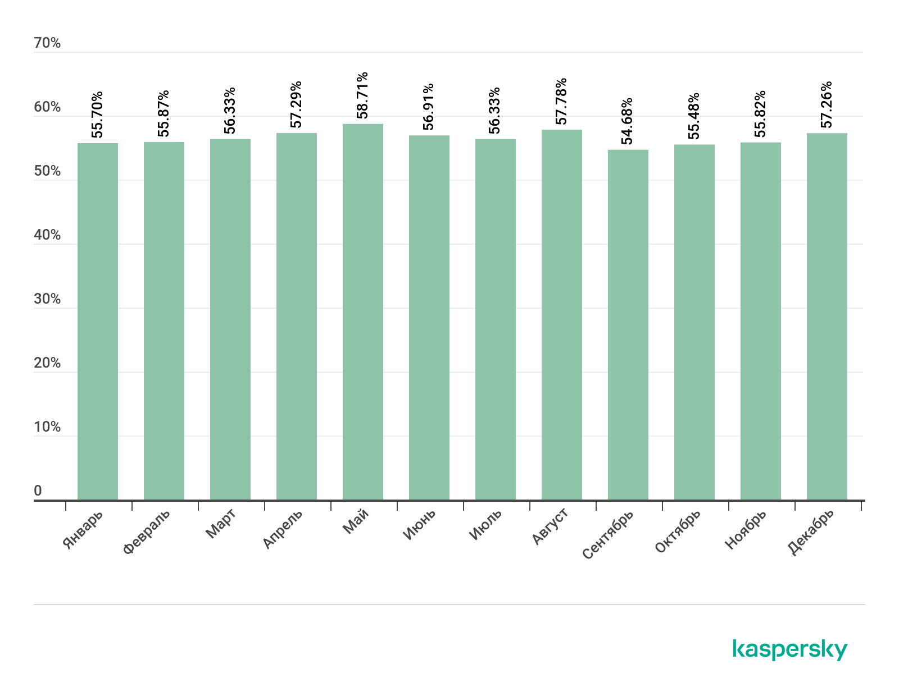

# Spam-detection-using-MultinomialNB
 
<a name="readme-top"></a>

<!-- Table of Contents -->
<details>
  <summary>Table of Contents</summary>
  <ol>
    <li>
      <a href="#about-the-project">About The Project</a>
      <ul>
        <li><a href="#built-with">Built With</a></li>
      </ul>
    </li>
    <li>
      <a href="#getting-started">Getting Started</a>
      <ul>
        <li><a href="#installation">Installation</a></li>
        <li><a href="#libraries">Libraries</a></li>
      </ul>
    </li>
    <li>
      <a href="#information_about_datasets">Information about datasets</a>
      <ul>  
        <li><a href="#dataset">Dataset</a></li>
        <li><a href="#custom_dataset_format">Сustom Dataset Format</a></li>
        <li><a href="#datasets_format_for_initializing_Multinomial_Naive_Bayes_Classifier">Datasets format for initializing Multinomial Naive Bayes Classifier</a></li>
      </ul>
    </li>
    <li><a href="#usage">Usage</a></li>
    <li><a href="#testing">Testing</a></li>
    <li><a href="#license">License</a></li>
  </ol>
</details>


<!-- About The Project -->
## <a name="about-the-project"> About The Project </a>

NLP - Natural Language Processing. This field in machine learning is dedicated to the recognition, generation, and processing of spoken and written human language. It intersects the disciplines of artificial intelligence and linguistics. NLP addresses various natural language processing tasks, such as speech recognition, text processing, information extraction, information analysis, text and speech generation, automatic summarization, and machine translation. In this project, a solution for text analysis has been implemented to determine the category (spam or ham) of a given text (message).

As of today, the issue of spam remains relevant. For instance, statistical data from 2019 provided by securelist.ru ([link_to_the_article][link_to_the_article_securelist]) indicate that globally, more than 50% of email traffic is comprised of spam. The share of spam in global email traffic for the year 2019 is shown in the figure below.



The project implements a **Multinomial Naive Bayes Classifier**. It is relatively simple to implement and demonstrates high accuracy, making it an effective solution for this problem. The implementation of the classifier addresses and resolves the following issues: "arithmetic overflow" and "unknown words". Laplace smoothing is used to address the latter issue, but you can set your own smoothing factor within the range `0 < __smoothing_factor <= 1`. Laplace smoothing corresponds to `__smoothing_factor = 1`. Classifier testing results confirm its high accuracy and suggest potential for further improvement.

The project code is located in three files: <a href="./code/SpamDetector.py">SpamDetector.py</a>, <a href="./code/TextProcessor.py">TextProcessor.py</a>, and <a href="./code/TrainMultinomialNB.py">TrainMultinomialNB.py</a>. In addition to these core files, the project includes the <a href="./code/dataset_preparation_and_analysis.ipynb">dataset_preparation_and_analysis.ipynb</a> file, which contains analysis with graphs of <a href="./dataset/email_dataset_1/spam_ham_dataset.csv">dataset 1</a>. The testing results of the implemented classifier can be found in the <a href="./code/spam_classifier_testing.ipynb">spam_classifier_testing.ipynb</a> file.

A detailed report on the theoretical and practical aspects of the work can be found in <a href="./%20Coursework%20Report.pdf">Coursework Report.pdf</a> (in Russian). Additionally, information about the practical implementation can be obtained from the code, which is sufficiently well-documented (I hope). The code documentation is provided in English. Information about the datasets used for training and testing can be found in the <a href="#dataset">Dataset</a> section. The structure of a dataset ready for training is presented in the <a href="#custom_dataset_format">Сustom Dataset Format</a> section. The structure of datasets obtained after training, which is used for initializing the classifier, is located in the <a href="#datasets_format_for_initializing_Multinomial_Naive_Bayes_Classifier">Datasets format for initializing Multinomial Naive Bayes Classifier</a> section. Information on how to work with this project is available in the <a href="#usage">Usage</a> section, while the testing results can be found in the <a href="#testing">Testing</a> section or in the corresponding <a href="./code/spam_classifier_testing.ipynb">file</a>.

### <a name="built-with"> Built With </a>

[![Badge Python][Badge_Python]][Python_home]
[![Badge NLTK][Badge_NLTK]][NLTK_home]
[![Badge Pandas][Badge_Pandas]][Pandas_home]
[![Badge NumPy][Badge_NumPy]][NumPy_home]
[![Badge Multiprocessing][Badge_Multiprocessing]][Multiprocessing_home]
[![Badge Jupyter-Notebook][Badge_Jupyter-Notebook]][Jupyter-Notebook_home]
[![Badge Matplotlib][Badge_Matplotlib]][Matplotlib_home]
[![Badge WordCloud][Badge_WordCloud]][WordCloud_home]

<p align="right">(<a href="#readme-top">back to top</a>)</p>


<!-- Getting Started -->
## <a name="getting-started"> Getting Started </a>

### <a name="installation"> Installation </a>

1. Clone the repository.
```sh
git clone https://github.com/rezabungel/Spam-detection-using-MultinomialNB.git
```
2. Be in the project's root directory.
3. Create a virtual environment.
```sh
python3.10 -m venv venv
```
4. Activate the created virtual environment.

For Linux/Mac
```sh
source venv/bin/activate
```
For Windows 
```sh
venv\Scripts\activate
```
5. Install the required libraries and dependencies.
```sh
python3.10 -m pip install -r requirements.txt
```

### <a name="libraries"> Libraries </a>

Required libraries
|   Library name   |        How to download manually          |                            Documentation                            |
| ---------------- | ---------------------------------------- | ------------------------------------------------------------------- |
| NLTK             | `python3.10 -m pip install nltk`         | [NLTK documentation][documentation-nltk]                            |
| NumPy            | `python3.10 -m pip install numpy`        | [NumPy documentation][documentation-numpy]                          |
| Pandas           | `python3.10 -m pip install pandas`       | [Pandas documentation][documentation-pandas]                        |
| Matplotlib       | `python3.10 -m pip install matplotlib`   | [Matplotlib documentation][documentation-matplotlib]                |
| Jupyter Notebook | `python3.10 -m pip install notebook`     | [Jupyter Notebook documentation][documentation-jupyter]             |
| WordCloud        | `python3.10 -m pip install wordcloud`    | [WordCloud documentation][documentation-wordcloud]                  |
| Multiprocessing  | installed by default                     | [Multiprocessing documentation][documentation-multiprocessing]      |
| String           | installed by default                     | [String documentation][documentation-string]                        |
| Math             | installed by default                     | [Math documentation][documentation-math]                            |
| os               | installed by default                     | [os documentation][documentation-os]                                |

But it would be best to use a virtual environment as demonstrated in the [Installation](#installation) section, rather than installing all the libraries manually.

<p align="right">(<a href="#readme-top">back to top</a>)</p>


<!-- Information about datasets -->
## <a name="information_about_datasets">Information about datasets</a>

### <a name="dataset"> Dataset </a>

The project utilizes three datasets of emails obtained from the [Kaggle][link_to_Kaggle]. Training was conducted for each dataset, so you can make use of the pre-trained models. It is worth noting that all datasets have different structures; therefore, before training, the datasets are standardized to the common format described in the <a href="#custom_dataset_format">Сustom Dataset Format</a> section.

Dataset 1 - **Spam Mails Dataset**: [Kaggle dataset link][link_to_dataset1_kaggle] or [link in the repository][link_to_dataset1].<br>
The training result utilized for model initialization:<br>
&nbsp;&nbsp;&nbsp;&nbsp; -> The model's email ratios data is [here][email_ratios_dataset1].<br>
&nbsp;&nbsp;&nbsp;&nbsp; -> The model's word frequencies data is [here][word_frequency_dataset1].

Dataset 2 - **Spam email Dataset**: [Kaggle dataset link][link_to_dataset2_kaggle] or [link in the repository][link_to_dataset2].<br>
The training result utilized for model initialization:<br>
&nbsp;&nbsp;&nbsp;&nbsp; -> The model's email ratios data is [here][email_ratios_dataset2].<br>
&nbsp;&nbsp;&nbsp;&nbsp; -> The model's word frequencies data is [here][word_frequency_dataset2].

Dataset 3 - **Spam Email Classification Dataset**: [Kaggle dataset link][link_to_dataset3_kaggle]. (The dataset is not in the repository because it is too large.)<br>
The training result utilized for model initialization:<br>
&nbsp;&nbsp;&nbsp;&nbsp; -> The model's email ratios data is [here][email_ratios_dataset3].<br>
&nbsp;&nbsp;&nbsp;&nbsp; -> The model's word frequencies data is [here][word_frequency_dataset3].

### <a name="custom_dataset_format"> Сustom Dataset Format </a>

To train the model, the dataset needs to be formatted to the following structure with ',' as the separator, where 0 represents "ham", and 1 represents "spam":
|  ,  |             text            | label |
| --- | --------------------------- | ----- |
|  0  | Some text of some letter... |   1   |
|  1  | Some text of some letter... |   1   |
|  2  | Some text of some letter... |   0   |
|  3  | Some text of some letter... |   1   |
| ... |             ...             |  ...  |

Examples of prepared and ready-to-train datasets 1 and 2 can be viewed [here][link_to_dataset1_ready_to_train] and [here][link_to_dataset2_ready_to_train].

### <a name="datasets_format_for_initializing_Multinomial_Naive_Bayes_Classifier"> Datasets format for initializing Multinomial Naive Bayes Classifier </a>

To initialize the Multinomial Naive Bayes Classifier, two datasets, namely email ratios and word frequencies, are utilized, which are obtained as a result of model training.<br>

**Email Ratios Dataset:**<br>
The structure of the email ratios dataset (using "," as a separator, the dataset consists of only one row):
|           ,            |             ham              |             spam              |
| ---------------------- | ---------------------------- | ----------------------------- |
| ratios-to-total-emails | Ratio of ham to total emails | Ratio of spam to total emails |

**Word Frequencies Dataset:**<br>
The structure of the word frequencies dataset (using "," as a separator):
|   ,    |          frequency          |            frequency_ham             |            frequency_spam             |
| ------ | --------------------------- | ------------------------------------ | ------------------------------------- |
| word_1 | Total occurrences of word_1 | Occurrences in Ham emails for word_1 | Occurrences in Spam emails for word_1 |
| word_2 | Total occurrences of word_2 | Occurrences in Ham emails for word_2 | Occurrences in Spam emails for word_2 |
| word_3 | Total occurrences of word_3 | Occurrences in Ham emails for word_3 | Occurrences in Spam emails for word_3 |
| word_4 | Total occurrences of word_4 | Occurrences in Ham emails for word_4 | Occurrences in Spam emails for word_4 |
|  ...   |             ...             |                 ...                  |                  ...                  |

<p align="right">(<a href="#readme-top">back to top</a>)</p>


<!-- Usage -->
## <a name="usage"> Usage </a>

In progress...

<p align="right">(<a href="#readme-top">back to top</a>)</p>


<!-- Testing -->
## <a name="testing"> Testing </a>

<p align="right">(<a href="#readme-top">back to top</a>)</p>


<!-- License -->
## <a name="license"> License </a>

Distributed under the BSD 3-Clause "New" or "Revised" License. See [LICENSE](LICENSE) for more information.

<p align="right">(<a href="#readme-top">back to top</a>)</p>


<!-- Markdown links -->
[Python_home]: https://www.python.org
[NLTK_home]: https://www.nltk.org
[Pandas_home]: https://pandas.pydata.org
[NumPy_home]: https://numpy.org
[Multiprocessing_home]: https://docs.python.org/3.10/library/multiprocessing.html
[Jupyter-Notebook_home]: https://jupyter.org
[Matplotlib_home]: https://matplotlib.org
[WordCloud_home]: http://amueller.github.io/word_cloud/

[documentation-nltk]: https://www.nltk.org/index.html
[documentation-numpy]: https://numpy.org/doc/
[documentation-pandas]: https://pandas.pydata.org/docs/
[documentation-matplotlib]: https://matplotlib.org/stable/users/index.html
[documentation-jupyter]: https://docs.jupyter.org/en/latest/
[documentation-wordcloud]: https://amueller.github.io/word_cloud/
[documentation-multiprocessing]: https://docs.python.org/3.10/library/multiprocessing.html
[documentation-string]: https://docs.python.org/3.10/library/string.html
[documentation-math]: https://docs.python.org/3.10/library/math.html
[documentation-os]: https://docs.python.org/3.10/library/os.html

[link_to_Kaggle]: https://www.kaggle.com
[link_to_dataset1_kaggle]: https://www.kaggle.com/datasets/venky73/spam-mails-dataset/data
[link_to_dataset1]: ./dataset/email_dataset_1/spam_ham_dataset.csv
[link_to_dataset1_ready_to_train]: ./dataset/email_dataset_1/model_data/spam_ham_dataset_ready_to_train.csv
[email_ratios_dataset1]: ./dataset/email_dataset_1/model_data/email_ratios.csv
[word_frequency_dataset1]: ./dataset/email_dataset_1/model_data/word_frequencies.csv
[link_to_dataset2_kaggle]: https://www.kaggle.com/datasets/jackksoncsie/spam-email-dataset
[link_to_dataset2]: ./dataset/email_dataset_2/emails.csv
[link_to_dataset2_ready_to_train]: ./dataset/email_dataset_2/model_data/emails_ready_to_train.csv
[email_ratios_dataset2]: ./dataset/email_dataset_2/model_data/email_ratios.csv
[word_frequency_dataset2]: ./dataset/email_dataset_2/model_data/word_frequencies.csv
[link_to_dataset3_kaggle]: https://www.kaggle.com/datasets/purusinghvi/email-spam-classification-dataset
[email_ratios_dataset3]: ./dataset/email_dataset_3/model_data/email_ratios.csv
[word_frequency_dataset3]: ./dataset/email_dataset_3/model_data/word_frequencies.csv

[link_SpamDetector.py]: [./code/SpamDetector.py]
[link_TextProcessor.py]: [./code/TextProcessor.py]
[link_TrainMultinomialNB.py]: [./code/TrainMultinomialNB.py]
[link_dataset_preparation_and_analysis.ipynb]: [./code/dataset_preparation_and_analysis.ipynb]
[link_spam_classifier_testing.ipynb]: [./code/spam_classifier_testing.ipynb]
[link_Coursework Report.pdf]: [./%20Coursework%20Report.pdf]

[Badge_Python]: https://img.shields.io/badge/3.10-ffffff?logo=python&logoColor=FFFFFF&label=Python&labelColor=000000
[Badge_NLTK]: https://img.shields.io/badge/NLTK-000000
[Badge_Pandas]: https://img.shields.io/badge/Pandas-000000?logo=pandas
[Badge_NumPy]: https://img.shields.io/badge/NumPy-000000?logo=numpy
[Badge_Multiprocessing]: https://img.shields.io/badge/Multiprocessing-000000
[Badge_Jupyter-Notebook]: https://img.shields.io/badge/Jupyter%20Notebook-000000?logo=jupyter&logoColor=white
[Badge_Matplotlib]: https://img.shields.io/badge/Matplotlib-000000
[Badge_WordCloud]: https://img.shields.io/badge/WordCloud-000000

[link_to_the_article_securelist]: https://securelist.ru/spam-report-2019/95727/